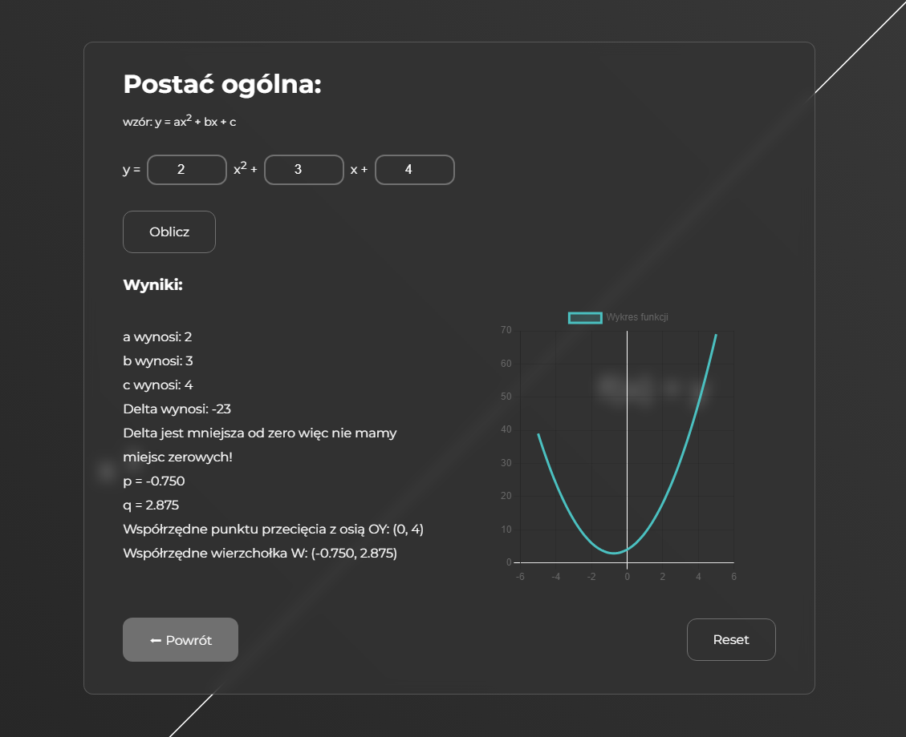

## How to run

`npm i` / `npm install`

`npm run dev`

# Demo

https://quadratic-function-calculator.netlify.app/

# My thoughts

### Description

This is quadratic function calculator make in react. I really proud of idea of ultils function. But I am wondering if this is a good way to rendering next components in the place where is primary component (using condition in the way that I using in App.jsx).

# ToDos:

| | - handle errors - inputs can't be empty

| | - optimize the app because I have the same code in 3 components

| | - add some animations between routing (optional)

### What app do?

This app calculates the zero spots, delta, whether delta is > 0, = 0, or < 0, and the coordinates of the vertex 'W' based on the selected form of the function

### I learnt:

- simple use of using react routing

### Problem:

- with transitions between routing: first component (this component in which you can choose form function) goes up and exits to the left because the second component is already in the DOM tree but not on the screen due to the initial animation (which moves it from right to left and stops it in the middle).
- in calculations because I forgot that values from inputs are strings and I simply needed to convert them to numbers [resolved ✔]

### Screenshots

