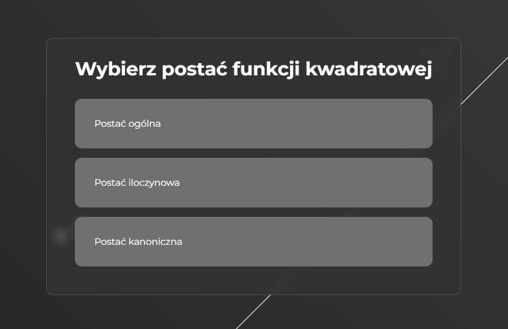

## How to run

`npm i` / `npm install`

`npm run dev`

# Demo

[quadratic-function-calculator](https://quadratic-function-calculator.netlify.app/)

# ToDos:

| x | - handle errors - inputs can't be empty

| | - add some animations between routing (optional)

| x | - add a graph

| x | - make RWD

| x | - apply some cool styling

### What app do?

This app calculates the zero spots, delta, whether delta is > 0, = 0, or < 0, and the coordinates of the vertex 'W' based on the selected form of the function and also shows chart

### I have learned:

- simple use of using react routing
- used chart.js a bit 

### Problem:

- with transitions between routing: first component (this component in which you can choose form function) goes up and exits to the left because the second component is already in the DOM tree but not on the screen due to the initial animation (which moves it from right to left and stops it in the middle).
- in calculations because I forgot that values from inputs are strings and I simply needed to convert them to numbers [resolved ✔]

### Screenshots

